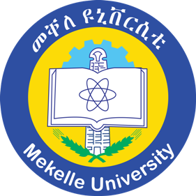

# MoVoC: Morphology-Aware Subword Construction for Ge’ez Script Languages

[](https://github.com/hailaykidu/MoVoC)
[](https://huggingface.co/spaces/dren-fzlj/movoc-tokenizer-playground)
[](https://arxiv.org/abs/2509.08812)

### 📣 Accepted at EMNLP 2025 (Findings)!

<br>

<p align="center">
  
  
</p>

<p align="center">
  
</p>

<p align="center">
  <a href="https://www.linkedin.com/in/hailay-kidu-teklehaymanot-679872328/">Hailay Kidu Teklehaymanot</a>,
  <a href="https://www.linkedin.com/in/drenfazlija">Dren Fazlija</a>,
  <a href="https://www.linkedin.com/in/wolfgangnejdl/">Wolfgang Nejdl</a>
  <br>
  L3S Research Center, Leibniz University Hannover, Germany
</p>

<details>
  <summary><b>Abstract (click to expand)</b></summary>
  <em>Subword-based tokenization methods often fail to preserve morphological boundaries, a limitation especially pronounced in low-resource, morphologically complex languages such as those written in the Ge‘ez script. To address this, we present MoVoC (Morpheme-Aware Subword Vocabulary Construction) and train MoVoC-Tok, a tokenizer that integrates supervised morphological analysis into the subword vocabulary. This hybrid segmentation approach combines morpheme-based and Byte Pair Encoding (BPE) tokens to preserve morphological integrity while maintaining lexical meaning. To tackle resource scarcity, we curate and release manually annotated morpheme data for four Ge‘ez script languages and a morpheme-aware vocabulary for two of them. While the proposed tokenization method does not lead to significant gains in automatic translation quality, we observe consistent improvements in intrinsic metrics, MorphoScore, and Boundary Precision, highlighting the value of morphology-aware segmentation in enhancing linguistic fidelity and token efficiency. Our morpheme-annotated datasets and tokenizer dataset will be publicly available under the Open Data licenses to support further research in low-resource, morphologically rich languages.</em>
</details>

<br>

<p align="center">
  
</p>
<p align="left">
  <b>MoVoC Pipeline.</b> <em>We first extract Amharic and Tigrinya words from our corresponding text corpora to perform token-based and morpheme-based separation, resulting in four different vocabularies. We then merge all four vocabularies to generate a single MoVoC-based vocabulary.</em>
</p>

## Motivation of this project

Languages written in the **Geʿez script**—such as Amharic, Tigrinya, Tigre, and Geʿez itself—are **morphologically rich** but **low-resource** in NLP.  
Standard subword tokenization approaches like **Byte Pair Encoding (BPE)** often split words into arbitrary fragments, losing important morphemes and harming performance in downstream tasks like machine translation.  

This project introduces **MoVoC (Morphology-Aware Vocabulary Construction)**, a new tokenization method that **aligns subword segmentation with morpheme boundaries**.  
By integrating morphological knowledge, MoVoC aims to provide better linguistic representations, especially critical for **low-resource Geʿez-script languages**.  


## Key experimental findings

- **Intrinsic evaluation**:  
  - MoVoC-Tok outperforms BPE and WordPiece on **morpheme boundary precision** and **Rényi entropy**, indicating more accurate and consistent subword segmentation.  
  - Gains are especially strong for the lower-resource languages **Tigre and Geʿez**.  

- **Machine translation experiments**:  
  - Tested on English → Amharic, Tigrinya, Tigre, and Geʿez.  
  - MoVoC-Tok consistently **improves BLEU and ChrF scores** compared to BPE and WordPiece.  
  - Example: English→Tigrinya BLEU rises from **0.172 (BPE)** to **0.205 (MoVoC-Tok)**.  

- **Qualitative analysis**:  
  - MoVoC preserves **morphological integrity** (e.g., correctly segmenting negation prefixes, roots, and suffixes in Tigrinya verbs).  
  - This leads to **clearer alignments** in translation and better handling of **rare or derived forms**.  


## Take-home message

- **MoVoC bridges a gap** in tokenization for Geʿez-script languages by making subword vocabularies **morphologically aware**.  
- While aggregate translation metrics show only **modest improvements**, MoVoC clearly enhances **linguistic fidelity** and model interpretability.  
- The release of **morphologically annotated datasets** and the MoVoC tokenizer provides a valuable resource for **future low-resource NLP research**.  
- Ultimately, MoVoC demonstrates that incorporating **linguistic structure into tokenization** is crucial for improving NLP in **morphologically complex, underrepresented languages**.  


## Citation
```bibtex
@inproceedings{teklehaymanot-etal-2025-movoc,
  title={MoVoC: Morphology-Aware Subword Construction for Ge'ez Script Languages},
  author={Teklehaymanot, Hailay Kidu and Fazlija, Dren and Nejdl, Wolfgang},
  booktitle={Findings of the Association for Computational Linguistics: EMNLP 2025},
  year={2025}
}
```
